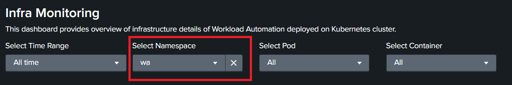

# HCL Workload Automation Observability for Splunk
You can use the HCL Workload Automation (HWA) Observability for Splunk to monitor HCL Workload Automation metrics, events, audit and infrastructure logs.

## Content
- [HCL Workload Automation Observability for Splunk](#hcl-workload-automation-observability-for-splunk)
  - [Content](#content)
- [Prerequisites](#prerequisites)
- [Language support](#language-support)
- [Installation](#installation)
    - [1. Installing and configuring splunk](#1-installing-and-configuring-splunk)
    - [2. Splunk installation](#2-splunk-installation)
      - [a. Install/Import HWA Monitoring App in Splunk](#a-installimport-hwa-monitoring-app-in-splunk)
      - [b. Create HEC Token](#b-create-hec-token)
    - [3. Splunk Otel Collector for Kubernetes](#3-splunk-otel-collector-for-kubernetes)
      - [a. Configuration for GKE cluster](#a-configuration-for-gke-cluster)
- [Getting Started with HCL Workload Automation Monitoring App](#getting-started-with-hcl-workload-automation-monitoring-app)
- [FAQs](#faqs)

# Prerequisites
Following prerequisites must be satisfied prior to deploy Splunk Solution: 
- Kubernetes cluster(OCP V4.7 or above, GKE) with administrative access
- HWA v10.x installed on the Kubernetes cluster 
- Tools & Packages 
  - [Helm3](https://helm.sh/docs/intro/install/) 
  - [Splunk OpenTelemetry Collector for Kubernetes](https://github.com/signalfx/splunk-otel-collector-chart) 

Note: To use the HWA Observability Dashboard for Splunk, HWA metrics must be available. For information about HWA exposed metrics, see [Exposing metrics to monitor your workload](https://help.hcltechsw.com/workloadautomation/v102/distr/src_ref/awsrgmonprom.html).

# Language support
For dashboards provided within HWA Observability for Splunk, the only supported language is English.   
  
  
# Installation

### 1. Installing and configuring splunk
1. From [HCL License Portal](https://id.hcltechsw.com/login/login.htm) download the appropriate HWA Observability installation package:
   HWA Observability for Splunk Add-on
2. Installation package for Splunk: HWA_OBSERVABILITY_APP_FOR_SPLUNK_10.x.tar.gz
3. Follow the below command to untar the gzip file 
  
  ```
    tar -xvzf HWA_OBSERVABILITY_APP_FOR_SPLUNK_10.x.tar.gz
  ```

4. Follow the steps mentioned in this ReadMe file to complete the solution setup.

### 2. Splunk installation
Splunk can be deployed on Kubernetes by using the official [Splunk Operator for Kubernetes](https://github.com/splunk/splunk-operator/blob/master/docs/README.md). Follow the steps mentioned in Splunk official documentation to setup Splunk by using Splunk Operator.


#### a. Install/Import HWA Monitoring App in Splunk 

HWA monitoring application is available as .spl file. 

Importing application steps: 
- Installing the HWA Monitoring App 
  - Go to the Splunk console’s home page by navigating to http://servername:8000 in your browser
  - Click on the gear icon:
  
    
  - Click Install app from file: 
    
  - Browse wa_monitoring_app.spl file and click Upload:
    
  - Click Settings > Server controls > Restart Splunk: 
    

For more information about installing app from file, refer to [Splunk documentation](https://docs.splunk.com/Documentation/AddOns/released/Overview/Singleserverinstall).
  
 
#### b. Create HEC Token
- The HEC Token for this application is `hwa_hec_token`, if you need to create a new HEC Token follow the below steps.
- Create an HEC token in Splunk following the steps listed in this [documentation](https://docs.splunk.com/Documentation/Splunk/9.0.1/Data/UsetheHTTPEventCollector#Configure_HTTP_Event_Collector_on_Splunk_Enterprise).
- Configure HEC token to send data to "hwa-logs" index.
  >- Select "Settings"
  >- Go to "Data Inputs"
  >- Select "HTTP Event Collector"
  >- Edit HEC token which you just created
  >- Among the allowed indexes, select "wa-metrics" and "hwa-logs"
  >- Save it

NOTE : If you selected `Enable SSL` in Global Settings, use HTTPS for HEC endpoint.	

### 3. Splunk Otel Collector for Kubernetes
Follow the below steps and install Splunk OpenTelemetry Collector for Kubernetes on your Kubernetes cluster. 

  
#### a. Configuration for GKE cluster
1. Add the following Helm repo
```
helm repo add splunk-otel-collector-chart https://signalfx.github.io/splunk-otel-collector-chart
```
2. Follow this [Pod Security Policy](https://github.com/signalfx/splunk-otel-collector-chart/blob/main/docs/advanced-configuration.md#manually-setting-pod-security-policy) documentation and run the step 1.

3. To install the Splunk OpenTelemetry Collector in a Kubernetes cluster, the splunkPlatform must be configured.
  Download and update the below steps in the [values.yaml](https://github.com/signalfx/splunk-otel-collector-chart/blob/main/helm-charts/splunk-otel-collector/values.yaml) file.

4. Prepare thie following Values file. Provide the following inputs to the variables:

| Variable name	 | Input to be given|
| ------ | ------ |
| clusterName	 | your clusterName |
| splunkPlatform.endpoint	 | your HEC endpoint |
| splunkPlatform.token	 | value of your HEC token|
| splunkPlatform.index  |	hwa-logs |
| splunkPlatform.metricsIndex |	wa-metrics |
| splunkPlatform.insecureSkipVerify  |	true |
| splunkPlatform.logsEnabled  |	true |
| splunkPlatform.metricsEnabled  |	true |
| cloudProvider  | gcp |
| distribution  |  gke |
| autodetect.prometheus  |	true |
| autodetect.istio  |	true |

NOTE : For openshift installation use  input `openshift` for  `distribution` variable 

5. Replace your agent.config with the following configuration:

```
config:           
    receivers:
      receiver_creator:
        watch_observers: [k8s_observer]
        receivers:
          prometheus_simple:
            rule: type == "pod" && annotations["prometheus.io/scrape"] == "true"
            config:
              endpoint: '`endpoint`:`31116`'
              metrics_path: '/metrics'
              collection_interval: 30s
              use_service_account: false
              tls:
                insecure: false
                insecure_skip_verify: true

```

6. Replace your logsCollection.containers.excludePaths with below excludePaths:

```
 excludePaths: ["/var/log/pods/*/*/*.log"]

```

7. Replace your fluentd.config.path with below path:

```
  path: /var/log/containers/*auditing*.log

```
8. Add the following custom ClusterRole rule in your values.yaml file along with all other required fields like clusterName, splunkPlatform.(Add this section at the bottom of the yaml file.)

```
  rbac:
    customRules:
      - apiGroups:     [extensions]
        resources:     [podsecuritypolicies]
        verbs:         [use]
        resourceNames: [splunk-otel-collector-psp]

```
9. Run the below command:

```
helm install my-splunk-otel-collector --values values.yaml splunk-otel-collector-chart/splunk-otel-collector
```

# Getting Started with HCL Workload Automation Monitoring App
The HWA Monitoring overview dashboard provides a single, consolidated view for monitoring the workload status. By selecting the dashboard on the list, you can see the information related to that dashboard. 

**HWA Monitoring Overview Dashboard** 

In the HWA Monitoring overview Dashboard, you can view the whole status of your workload at a glance for one or more of the engines you have configured.  

**Overview Dashboard**: 
 

By clicking a button or menu option, you open a new tab displaying the selected dashboard information. The following dashboards are supported: 

- **Jobs and Job Streams**. This dashboard shows the status of Jobs, Critical jobs and Job Streams. 

  Source of Information: HWA Deployment events sidecar container and HWA server Logs.

- **KPIs and Workstations**. This dashboard shows the HCL Workload Automation KPIs information for each host and allows drilldown to see the timeseries data in visual representation for defined KPIs.

  Source of Information : API exposed by HWA Server on port 31116.
   
- **Activity Monitoring**. This dashboard shows details of workstations and audit information such as user actions. Users can view audit information for selected time range, user and object. 

  Source of Information:  HWA Deployment sidecar audit containers, for example: waserver-db-auditing, waserver-plan-auditing etc. 

- **Infra Monitoring**.  This dashboard provides an overview of the infrastructure details of HCL Workload Automation deployed on Kubernetes cluster. Filter by your Kubernetes namespace and view the dashboard as shown below:
 
  Source of Information: Infrastructure Logs exposed by Kubernetes/Openshift cluster. 

- **Alerts Dashboard**. The HWA monitoring application comes with predefined alerts configured as an example. User can navigate to alerts page and easily enable/disable these alerts when needed. The statistical reports and graphical visualizations of the alerts created for HWA application can be viewed in HWA Alerts dashboard. Follow this [Splunk documentation](https://docs.splunk.com/Documentation/Splunk/8.2.4/Analytics/Alerts) to manage alerts (create new,enable & disable,etc...). in Splunk application.
Follow this [Splunk documentation](https://docs.splunk.com/Documentation/Splunk/8.2.4/Alert/Emailnotification) to configure the email setting in the Splunk application.

The following table shows some of the out-of-the-box alert definitions that come with the HWA Monitoring Application:
| Monitor Name	| Severity | Trigger Condition |
| ------ | ------ | ------ |
| WA_Broker_Status	| Critical | ==0 (more than 5 minutes) |
| WA_server_link_status | Critical |	==0 (more than 5 minutes) |
| WA_DB_connected |	Critical |	==0 (more than 30 sec) |
| WA_Agent_running |	Critical |	==0 (more than 5 minute) |
| WA_FINAL_Error |	Critical |	==1 (more than 30 sec) |
| WA_FINAL_Late |	Critical |	==1 (more than 30 sec) |
| WA_LicenseUncounted |	Critical |	> 0 (more than 1day) |
| *WA_UI_Available* |	Critical |	HTTP code != 200 |
| *WA_Master_Available* |	Critical |	HTTP code != 200 |
| WA_DB_connected_Warning |	Low	|==0 (more than 10 sec) |
| WA_LicenseUncounted_Warning |	Low	|> 0 (more than 70 min) |

**Note: By default, all the above alerts are disabled. You need to enable them based on your requirements.**

The *WA_UI_Available* and *WA_Master_Available* alert definitions needs to be updated with your HWA Console and HWA Server environment URLs respectively. So, follow this [Splunk doumentation](https://docs.splunk.com/Documentation/Splunk/8.2.4/Alert/Alertspage#Edit_an_alert_search) to edit the alert definitions.                                                  
 
# FAQs
1. Q: What are the Supported platforms?
   
   A: The solution can be deployed on OpenShift Cluster Platform (OCP) version 4.7 and above, Google Kubernetes Engine(GKE). 

2. Q: Where to access the installation details? 
  
   A: Installation steps are provided in this document. Also provided external links wherever applicable. 

3. Q: Which Splunk product is supported? Splunk Enterprise, Splunk Cloud, or Splunk Observability? 
  
   A: This solution can be deployed on Splunk Enterprise trial version 9.0.x. Support will be extended to other products like Splunk Cloud and Splunk Observability in 
  the future releases. 

4. Q: How to troubleshoot the Splunk OTel Collector?
  
   A: Follow this [Splunk OpenTelemetry Collector troubleshooting ](https://github.com/signalfx/splunk-otel-collector-chart/blob/main/docs/troubleshooting.md) documentation.
   
5. Q: How to increase the size of Splunk OTel Collector containers?

   A: Follow this [Sizing Splunk OTel collector containers](
https://github.com/signalfx/splunk-otel-collector-chart/blob/main/docs/troubleshooting.md#sizing-splunk-otel-collector-containers) documentation.

   
6. Q: What are the indexes required by HWA Monitoring Splunk App? 
  
   A: HWA Monitoring App utilizes 2 indexes: ***hwa-logs*** and ***wa-metrics***.
   
7. Q:  Where I can find infrastructure details of Kubernetes cluster?
  
   A: The Kubernetes cluster infrastructure details can be found in Infra Monitoring dashboard. 
    You can navigate to Infra Monitoring dashboard by either selecting menu item or click on button from overview page.
    Select HWA namespace from dropdown on Infra Monitoring dashboard to display PODS, CONTAINERS and DEPLOYMENT details. 
    
8. Q: What insight is available about different audit types? 
    
   A: You can view the details of audit type and its insight in Activity Monitoring dashboard. 
       There are various audit types where user interaction with the system; Database, Plan, Conman,Stageman etc.  
       
9. Q: HWA Observability Dashboard doesn't show infrastructure details of your Kubernetes cluster?
     
   A: Filter by your Kubernetes namespace and view the infrastructure details.
	
10. Q: Can I view the workstations status? 
     
    A: Yes, you can view the workstation status on ***KPIs and Workstations*** dashboard. 
          
11. Q: How do I create a new alert?
    
    A: The Splunk documentation provides step by step procedure to create alerts in Splunk. You can follow this [Splunk documentation](https://docs.splunk.com/Documentation/SplunkCloud/8.2.2203/Alert/Definescheduledalerts) to create new alert. For more details, see  [Alert Examples](https://docs.splunk.com/Documentation/Splunk/8.2.4/Alert/Alertexamples)
    
 12. Q: Can I modify/edit existing alert?
    
    -  Yes, you can modify an existing alert in two ways.
    -  Method 1:
        1.	Select *Alerts* from the top bar of the home page.
        2.	Find the Alert name, click the *Edit* button and edit the alert.
    -  Method 2:
        1.	Select *Alerts Dashboard* from the top bar of the home page.
        2.	Select Alerts Name from the *Alerts* section. A new tab will open.
	
13. Q: How can I update the alert search query?
     
    A:  Splunk documentation provides the steps to update the alert search query. For more details, see this [Splunk documentation](https://docs.splunk.com/Documentation/Splunk/8.2.4/Alert/Alertspage#Edit_an_alert_search)
     
 14. Q: Does Splunk support adding multiple severity for an alert? For example, an alert could be triggered as LOW severity based on some thresholds, and as HIGH severity based on other thresholds. Can I configure both conditions for the alert? 
       
     A:  No, Splunk does not support adding complex alerts and adding multiple severity for an alert. Alternatively, you can create two different alerts and add the severity based on its conditions. 
    
  15. Q:  Alerts/Emails are triggered very frequently, sending emails repeatedly. How can I avoid this? 
        
      A:  A frequently triggered alert indicates that alert is configured with a low throttle time (time interval). You can increase the throttle time by editing the alert, selecting the throttle checkbox, and entering *Suppress triggering for* the time interval needed between the subsequent triggers of the alert. For example, if *Suppress triggering for* is set to 1 hour, the alert triggers every hour.
  
