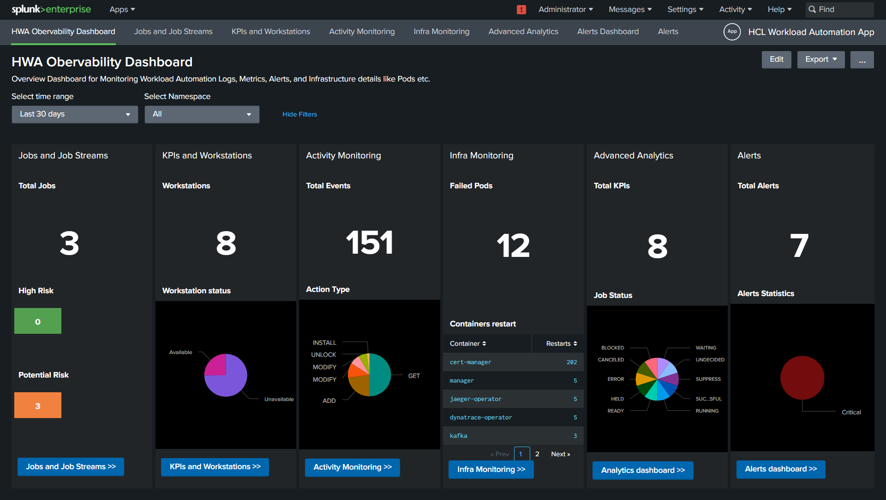

# HCL Workload Automation Observability for Splunk
You can use the HCL Workload Automation (HWA) Observability for Splunk to monitor HCL Workload Automation metrics, events, audit and infrastructure logs.

## Content
  - [Prerequisites](#prerequisites)
  - [Language support](#language-support)
  - [Installation](#installation)
      - [1. Splunk installation](#1-splunk-installation)
          - [a). Create required index in Splunk](#a-create-required-index-in-splunk)
          - [b). Create HEC Token](#b-create-HEC-Token)
      - [2. Splunk Connect for Kubernetes](#2-splunk-connect-for-kubernetes)
          - [a). Configuration for GKE cluster](#a-configuration-for-gke-cluster)
          - [b). Configuration for Openshift cluster](#b-configuration-for-openshift-cluster)
  - [HWA Monitoring App Setup in Splunk](#hwa-monitoring-app-setup-in-splunk)
      - [1. Install or Import HWA Monitoring App in Splunk](#1-install-or-import-hwa-monitoring-app-in-splunk)
      - [2. Configure HWA Monitoring App](#2-configure-hwa-monitoring-app)
      - [3. Setting the Exporter for reading data from HWA Metrics API ](#3-setting-the-exporter-for-reading-data-from-hwa-metrics-api)
  - [Getting Started with HCL Workload Automation Monitoring App](#getting-started-with-hcl-workload-automation-monitoring-app)
  - [FAQs](#faqs)

# Prerequisites
Following prerequisites must be satisfied prior to deploy Splunk Solution: 
- Kubernetes cluster(OCP V4.7 or above, GKE) with administrative access
- HWA v10 installed on the Kubernetes cluster 
- Tools & Packages 
  - [Helm3](https://helm.sh/docs/intro/install/) 
  - [Splunk Connect for Kubernetes](https://github.com/splunk/splunk-connect-for-kubernetes/releases)

# Language support
For dashboards provided within HWA Observability for Splunk, the only supported language is English.   
  
# Installation

### 1. Splunk installation
Splunk can be deployed on Kubernetes by using official [Splunk Operator for Kubernetes](https://github.com/splunk/splunk-operator/blob/master/docs/README.md). Follow the steps mentioned in Splunk official documentation to setup Splunk by using Splunk Operator.

#### a. Create required index in Splunk 
- Our Solution requires an event type index in Splunk platform with name "hwa-logs" to collect the log data. The same can be created by following [splunk official documentation](https://dev.splunk.com/enterprise/tutorials/module_getstarted/useeventgen/#Create-an-index-for-tutorial-sample-events). 

#### b. Create HEC Token
- Create an HEC token in Splunk following the steps listed in this [documentation](https://docs.splunk.com/Documentation/Splunk/9.0.1/Data/UsetheHTTPEventCollector#Configure_HTTP_Event_Collector_on_Splunk_Enterprise).
- Configure HEC token to send data to "hwa-logs" index.
  >- Select "Settings"
  >- Go to "Data Inputs"
  >- Select "HTTP Event Collector"
  >- Edit HEC token which you just created .
  >- Among the allowed indexes, select "hwa-logs".
  >- Save it.

### 2. Splunk Connect for Kubernetes
Follow below given steps and install Splunk Connect for Kubernetes on your Kubernetes cluster. 
#### a. Configuration for GKE cluster
Steps to follow:
1. Add Splunk chart repo
```
helm repo add splunk https://splunk.github.io/splunk-connect-for-kubernetes/

```
2. Get values file in your working directory

Helm 2
```
helm inspect values splunk/splunk-connect-for-kubernetes > values.yaml
```

Helm 3

```
helm show values splunk/splunk-connect-for-kubernetes > values.yaml
```
3. Prepare this Values file. 
Provide the following inputs to the variables:

| Variable name	 | Input to be given|
| ------ | ------ |
| global>token	 | value of your HEC token|
| global>fullUrl  |	splunk url |
| global>indexName |	hwa-logs |
| global>insecureSSL  |	True |
| global>containers>logFormatType  |	cri|
| splunk-kubernetes-logging>enabled  |	True|
| splunk-kubernetes-objects>enabled  |	True|
| splunk-kubernetes-metric>enabled  |	False|

4. Install the chart by running

Helm 2
```
helm install --name my-splunk-connect -f values.yaml splunk/splunk-connect-for-kubernetes
```

Helm 3
```
helm install my-splunk-connect -f values.yaml splunk/splunk-connect-for-kubernetes
```
#### b. Configuration for Openshift cluster
Steps to follow:
1. Copy below content to your values.yaml file.
```
#
# Deploy the logging component to OpenShift.
#
# Additionally the system:openshift:scc:privileged ClusterRoleBinding for
# the fluentd pod ServiceAccount needs to be created manually.
#
---
global:
  splunk:
    hec:
      token: 
      host: 34.138.190.10
      port: 8088
      indexName: hwa-logs
      insecureSSL: true
  kubernetes:
    clusterName: my-cluster

splunk-kubernetes-logging:
  enabled: true
  kubernetes:
    # the next actually sets .securityContext.privileged
    # privileged is required, due to SELinux preventing
    # write access for the *.pos files of fluentd.
    securityContext: true
  containers:
    logFormatType: cri
    logFormat: "%Y-%m-%dT%H:%M:%S.%N%:z"
  journalLogPath: /var/log/journal
  logs:
    # The `kube-audit` file has another path on OpenShift
    kube-audit:
      from:
        file:
          path: /var/log/kube-apiserver/audit.log
    # Next 2 logfiles are specific to OpenShift
    openshift-audit:
      from:
        file:
          path: /var/log/openshift-apiserver/audit.log
      timestampExtraction:
        format: "%Y-%m-%dT%H:%M:%SZ"
      sourcetype: kube:openshift-apiserver-audit
    oauth-audit:
      from:
        file:
          path: /var/log/oauth-apiserver/audit.log
      timestampExtraction:
        format: "%Y-%m-%dT%H:%M:%SZ"
      sourcetype: kube:oauth-apiserver-audit

splunk-kubernetes-metrics:
  enabled: false

splunk-kubernetes-objects:
  enabled: false
```

2. Make suitable changes in values.yaml
> - hec_token
> - host 

3. Install the chart by running

Helm 2
```
helm install --name my-splunk-connect -f values.yaml splunk/splunk-connect-for-kubernetes
```

Helm 3
```
helm install my-splunk-connect -f values.yaml splunk/splunk-connect-for-kubernetes
```


For any question, you can refer to [Splunk Connect for Kubernetes](https://github.com/splunk/splunk-connect-for-kubernetes).


NOTE: HWA Monitoring App use "hwa-logs" index as a HWA data source. <ins>Before moving to next step</ins> (setting up of HWA Monitoring App) make sure this index is present and have the proper HWA data.  


# HWA Monitoring App Setup in Splunk 
Administrators need to create indexes in Splunk to configure the logs and metrics data flow into the application. 

### 1. Install or Import HWA Monitoring App in Splunk

HWA monitoring application is available as .spl file. 

Importing application steps: 
- Installing the HWA Monitoring App 
  - Go to the Splunk console’s home page by navigating to http://<server_name>:8000 in your browser
  - Click on the gear icon:
  
    
  - Click Install app from file: 
    
  - Browse wa_monitoring_app.spl file and click Upload:
    
  - Click Settings > Server controls > Restart Splunk: 
    

For more information about installing app from file, refer to [Splunk documentation](https://docs.splunk.com/Documentation/AddOns/released/Overview/Singleserverinstall).
  
  
### 2. Configure HWA Monitoring App 

The HWA Monitoring App is installed along with the following:  

  - Automatic Field mapping 
  - Automatic Indexes mapping 
  - Automatic creation of dashboards 
  - Exporter script  
  
  
### 3. Setting the Exporter for reading data from HWA Metrics API 
Enter inside your splunk pod .

<ins>Environment details need to be provided to wa-app.conf</ins>. This file is present inside splunk pod at path $SPLUNK_HOME/etc/apps/wa-monitoring-app/appserver/static/wa-app.conf.

NOTE: 
  1. Do not change SPLUNK_HEC_URL
  2. After giving other details in wa-app.conf file, configure "wa-metrics" index in splunk as done in step-1(b) for "hwa-logs" index.

Exporter script present in splunk pod at path $SPLUNK_HOME/etc/apps/wa-monitoring-app/bin/ will pull details present in wa-app.conf and thus, ingest metrics from endpoint to the splunk.

Now, you are good to go.

# Getting Started with HCL Workload Automation Monitoring App
The HWA Monitoring overview dashboard provides a single, consolidated view for monitoring the workload status. By selecting the dashboard on the list, you can see the information related to that dashboard. 

**HWA Monitoring Overview Dashboard** 

In the HWA Monitoring overview Dashboard, you can view the whole status of your workload at a glance for one or more of the engines you have configured.  

Overview Dashboard: 
 

By clicking a button or menu option, you open a new tab displaying the selected dashboard information. The following dashboards are supported: 

- **Jobs and Job Streams**. This dashboard shows the status of Jobs, Critical jobs and Job Streams. 

  Source of Information: HWA Deployment events sidecar container and HWA server Logs.

- **KPIs and Workstations**. This dashboard shows the HCL Workload Automation KPIs information for each host and allows drilldown to see the timeseries data in visual representation for defined KPIs.

  Source of Information : API exposed by HWA Server on port 31116.
   
- **Activity Monitoring**. This dashboard shows details of workstations and audit information such as user actions. Users can view audit information for selected time range, user and object. 

  Source of Information:  HWA Deployment sidecar audit containers, for example: waserver-db-auditing, waserver-plan-auditing etc. 

- **Infra Monitoring**. This dashboard provides an overview of the infrastructure details of HCL Workload Automation deployed on Kubernetes cluster. 

  Source of Information: Infrastructure Logs exposed by Openshift cluster. 

- **Alerts**. The HWA monitoring application comes with predefined alerts configured as an example. User can navigate to alerts page and easily enable/disable these alerts when needed. The statistical reports and graphical visualizations of the alerts created for HWA application can be viewed in HWA Alerts dashboard. Follow this [Splunk documentation](https://docs.splunk.com/Documentation/Splunk/8.2.4/Analytics/Alerts) to manage alerts (create new,enable & disable,etc...). in Splunk application.
Follow this [Splunk documentation](https://docs.splunk.com/Documentation/Splunk/8.2.4/Alert/Emailnotification)  to configure the email setting in Splunk application.

The following table shows some of the out-of-the-box alert definitions that come with the HWA Monitoring Application:
| Monitor Name	| Severity | Trigger Condition |
| ------ | ------ | ------ |
| WA_Broker_Status	| Critical | ==0 (more than 5 minutes) |
| WA_server_link_status | Critical |	==0 (more than 5 minutes) |
| WA_DB_connected |	Critical |	==0 (more than 30 sec) |
| WA_Agent_running |	Critical |	==0 (more than 5 minute) |
| WA_FINAL_Error |	Critical |	==1 (more than 30 sec) |
| WA_FINAL_Late |	Critical |	==1 (more than 30 sec) |
| WA_LicenseUncounted |	Critical |	> 0 (more than 1day) |
| *WA_UI_Available* |	Critical |	HTTP code != 200 |
| *WA_Master_Available* |	Critical |	HTTP code != 200 |
| WA_DB_connected_Warning |	Low	|==0 (more than 10 sec) |
| WA_LicenseUncounted_Warning |	Low	|> 0 (more than 70 min) |

**Note: By default, all the above alerts are disabled. You need to enable them based on your requirements.**

The *WA_UI_Available* and *WA_Master_Available* alert definitions needs to be updated with your HWA Console and HWA Server environment URLs respectively. So follow this [Splunk doumentation](https://docs.splunk.com/Documentation/Splunk/8.2.4/Alert/Alertspage#Edit_an_alert_search) to edit the alert definitions.                                                  
 
# FAQs
- Q: What are the Supported platforms?
  - A: The solution can be deployed on OpenShift Cluster Platform (OCP) version 4.7 and above, Google Kubernetes Engine(GKE). 
- Q: Where to access the installation details? 
  - A: Installation steps are provided in this document. Also provided external links wherever applicable. 
- Q: Which Splunk product is supported? Splunk Enterprise, Splunk Cloud, or Splunk Observability? 
  - A: This solution can be deployed on Splunk Enterprise trial version 8.2.x. Support will be extended to other products like Splunk Cloud and Splunk Observability in the future releases. 
- Q. I am unable to complete splunk connect for kubernetes part of installation. What should i do ?
  - A: Refer this [Splunk Connect for Kubernetes](https://github.com/splunk/splunk-connect-for-kubernetes).
- Q. What are the indexes required by HWA Monitoring Splunk App? 
  - A: HWA Monitoring App utilizes 2 indexes: ***hwa-logs*** and ***wa-metrics-index***. 
- Q. Where can I found the logs of the Exporter that have been deployed along with HWA Monitoring App in Splunk? 
  - A: Exporter logs can be found at the following location: /opt/splunk/var/log/splunk/splunkd.log. 
- Q. I already have cluster logging mechanisms along with log forwarder. How can I use this solution? 
  - A: Log forwarder should send HWA log data to index named *“openshift”* in Splunk. 
- Q:  Where I can find infrastructure details of Kubernetes cluster?
  - The Kubernetes cluster infrastructure details can be found in Infra Monitoring dashboard. 
    You can navigate to Infra Monitoring dashboard by either selecting menu item or click on 	button from overview page.
    Select HWA release from dropdown on Infra Monitoring dashboard to display PODS, NODES, CONTAINERS and DEPLOYMENT details. 
- Q. What insight is available about different audit types? 
    -  You can view the details of audit type and its insight in Activity Monitoring dashboard. 
       There are various audit types where user interaction with the system; Database, Plan, Conman,Stageman etc.  
- Q. Can I view the generated jobs by its category? 
     -  Yes, you can view the generated jobs by its category in ***KPIs and Workstations*** dashboard. 	
        You can view the jobs by its category like jobs by workstation, jobs by folder, jobs by plan 	count etc.   
- Q. Can I view the workstations status? 
     - Yes, you can view the workstation status on ***KPIs and Workstations*** dashboard. 
      Navigate to KPIs and Workstations, select the dropdown of workstations section to see the Available & Unavailable Workstations  
- Q.  Are we supporting the Splunk feature Dashboard Studio for HWA application?  
    - No, Splunk dashboard studio feature is not supported with this tech-preview release.  
- Q. How do I create a new alert?
    - The Splunk documentation provides step by step procedure to create alerts in Splunk. You can follow this [Splunk documentation](https://docs.splunk.com/Documentation/SplunkCloud/8.2.2203/Alert/Definescheduledalerts) to create new alert. For more details, see  [Alert Examples](https://docs.splunk.com/Documentation/Splunk/8.2.4/Alert/Alertexamples)
 - Q. Can I modify/edit existing alert?
    -  Yes, you can modify an existing alert in two ways.
    -  Method 1:
        1.	Select *Alerts* from the top bar of the home page.
        2.	Find the Alert name, click the *Edit* button and edit the alert.
    -  Method 2:
        1.	Select *Alerts Dashboard* from the top bar of the home page.
        2.	Select Alerts Name from the *Alerts* section. A new tab will open.
 - Q. How can I update alert search query?
     -  Splunk documentation provides the steps to update the alert search query. For more details, see this [Splunk documentation](https://docs.splunk.com/Documentation/Splunk/8.2.4/Alert/Alertspage#Edit_an_alert_search)
 - Q. Does Splunk support adding multiple severity for an alert? For example, an alert could be triggered as LOW severity based on some thresholds, and as HIGH severity  based on other thresholds. Can I configure both conditions for the alert? 
    -  No, Splunk does not support adding complex alerts and adding multiple severity for an alert. Alternatively, you can create two different alerts and add the severity based on its conditions. 
  - Q.  Alerts/Emails are triggered very frequently, sending emails repeatedly. How can I avoid this? 
    - A frequently triggered alert indicates that alert is configured with a low throttle time. (Time interval). You can increase the throttle time by editing the alert, selecting the throttle checkbox, and entering *Suppress triggering for* the time interval needed between the subsequent triggers of the alert. For example, if *Suppress triggering for* is set to 1 hour, the alert triggers every hour.
  
